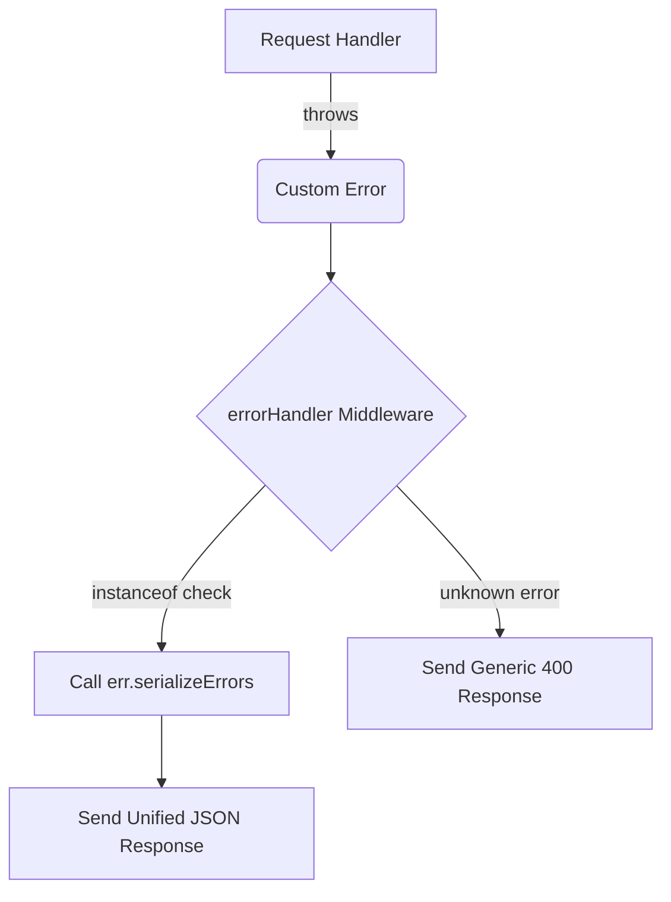

# Error Handling Architecture

This document describes the consistent error handling pattern used across our microservices. The goal is to ensure that every error returned to the client follows a unified structure, regardless of the service or the reason for the error.

## Unified Error Structure

All error responses follow this JSON structure:

```json
{
  "errors": [
    {
      "message": "A descriptive error message",
      "field": "optional_field_name"
    }
  ]
}
```

## The "Serialized Errors" Pattern

Instead of having a monolithic error handler that knows about every possible error type, we use a delegation-based approach.

1.  **Custom Error Subclasses**: Every specific error type (e.g., validation, database, authorization) is represented by a subclass of the built-in `Error` class.
2.  **Shared Interface**: Each subclass is required to implement:
    -   `statusCode`: The appropriate HTTP status code.
    -   `serializeErrors()`: A method that returns the unified error structure.
3.  **Global Middleware**: The `errorHandler` middleware catches all errors. If it's a known custom error, it simply calls `serializeErrors()` and uses the provided `statusCode`.

## Architecture Flow Diagram



## Benefits

-   **Consistency**: The client-side (React) only needs one way to parse errors.
-   **Scalability**: Adding a new error type only requires creating a new class; the middleware remains unchanged.
-   **Separation of Concerns**: Each error class is responsible for its own formatting logic.
